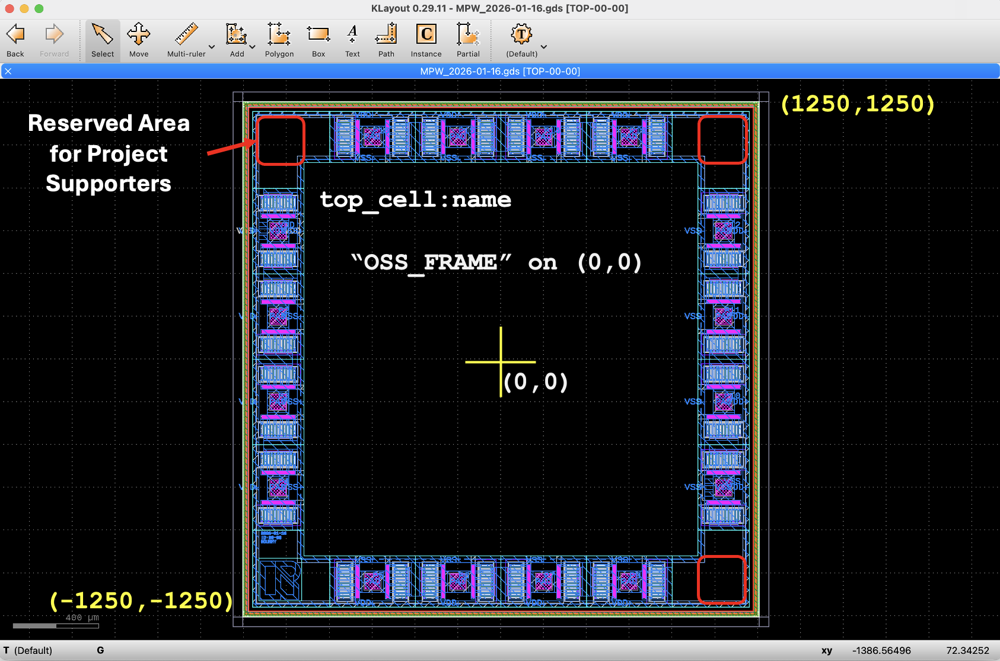
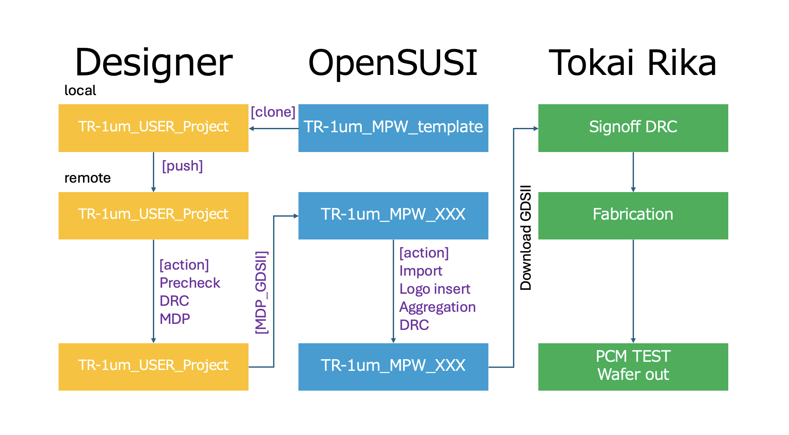

# TR-1um MPW Template

- [Full documentation](docs/info.md)

---

## Quick Start

1. Fork this repository
2. Edit `info.yaml` (set your top cell name)
3. Place your files in `src/`
   - `<top_cell>.gds`
   - `<top_cell>.cir`
4. Push to GitHub

→ CI will automatically run **Pre-check / DRC / LVS / MDP**

---

## Source Files

Place your design files in the `src/` directory:

- `<top_cell>.gds` : layout file
- `<top_cell>.cir` : circuit netlist

⚠️ The file name must match `gds.top_cell` in `info.yaml`.

---

## Configuration (info.yaml)

The project is configured via `info.yaml`.

Key fields:

- `gds.top_cell` : top cell name (must match GDS)
- `gds.extension` : layout file extension
- `lvs.extension` : netlist file extension
- `lvs.netlist_only` : enable/disable LVS comparison
- `mdp.file` : output MDP GDS file name
- `pdk.repo` : PDK repository
- `pdk.ref` : PDK version
- `pdk.dir` : ruleset directory

See [docs/info.md](docs/info.md) for full details.

---

## CI Workflow

The GitHub Actions pipeline automatically validates your design.

---

### Pre-check

Validates:

- Top cell name matches `info.yaml (gds.top_cell)`
- Exactly one top-level cell exists
- Database unit (dbu) is `0.001 µm`
- Layout bounding box is within: